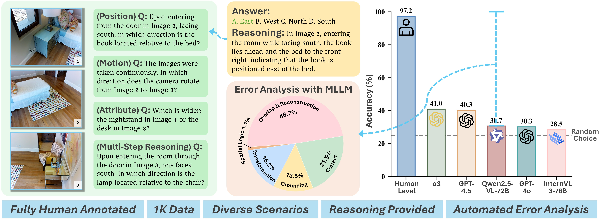

<div align="center">

# MMSI-Bench 

</div>

<p align="center">
  <!-- <b>Authors</b><br> -->
  <a href="https://github.com/sihany077" target="_blank">Sihan Yang<sup>1*</sup></a>,
  <a href="https://runsenxu.com" target="_blank">Runsen Xu<sup>1,2*‡</sup></a>,
  <a href="https://github.com/kuaikuaixym" target="_blank">Yiman Xie<sup>1,3</sup></a>,
  <a href="https://yangsizhe.github.io/" target="_blank">Sizhe Yang<sup>1,2</sup></a>,
  <a href="https://github.com/Mor-Li" target="_blank">Mo Li<sup>1,4</sup></a>,
  <a href="https://mail.sjtu.edu.cn/zimbra/mail#1" target="_blank">Jingli Lin<sup>1,5</sup></a>,
  <a href="https://github.com/ZCMax" target="_blank">Chenming Zhu<sup>1,6</sup></a>,
  <a href="https://xiaochenchen.com/" target="_blank">Xiaochen Chen<sup>7</sup></a>,
  <a href="https://kennymckormick.github.io/" target="_blank">Haodong Duan<sup>1</sup></a>,
  <a href="https://openreview.net/profile?id=~Xiangyu_Yue1" target="_blank">Xiangyu Yue<sup>1,2</sup></a>,
  <a href="http://dahua.site/" target="_blank">Dahua Lin<sup>1,2</sup></a>,
  <a href="https://tai-wang.github.io/" target="_blank">Tai Wang<sup>1†</sup></a>,
  <a href="https://oceanpang.github.io/" target="_blank">Jiangmiao Pang<sup>1†</sup></a>
</p>

<p align="center">
  <sup>1</sup>Shanghai AI Laboratory,
  <sup>2</sup>The Chinese University of Hong Kong,
  <sup>3</sup>Zhejiang University,
  <sup>4</sup>Tsinghua University,
  <sup>5</sup>Shanghai Jiaotong University,
  <sup>6</sup>University of Hong Kong,
  <sup>7</sup>Beijing Normal University
</p>

<p align="center">
  <sup>*</sup>Equal Contribution &nbsp;&nbsp;
  <sup>‡</sup>Project Lead &nbsp;&nbsp;
  <sup>†</sup>Corresponding Author
</p>


<!-- [**🌐 Homepage**](https://runsenxu.com/projects/MMSI_Bench/) | [**🤗 Dataset**](https://huggingface.co/datasets/RunsenXu/MMSI-Bench) | [**📑 Paper**](https://arxiv.org/pdf/2505.23764)  | [**📖 arXiv**](https://arxiv.org/abs/2505.23764)   -->
<p align="center">
  <a href="https://runsenxu.com/projects/MMSI_Bench/">🌐 Homepage</a> |
  <a href="https://huggingface.co/datasets/RunsenXu/MMSI-Bench">🤗 Dataset</a> |
  <a href="https://arxiv.org/pdf/2505.23764">📑 Paper</a>  |
  <a href="https://arxiv.org/abs/2505.23764">📖 arXiv</a>
</p>


## 🔔News
🔥[2025-06-28]: MMSI-Bench is now officially supported by [OpenCompass Spatial Leaderboard](https://huggingface.co/spaces/opencompass/openlmm_spatial_leaderboard) as a key benchmark for spatial understanding. It includes a *circular* testing protocol that effectively reduces the impact of random guessing. The best-performing non-thinking model so far, [Seed-VL 1.5](https://www.google.com.hk/search?q=seed-vl-1.5), achieves **20.3%** accuracy.

🔥[2025-06-18]: MMSI-Bench has been supported in the [LMMs-Eval](https://github.com/EvolvingLMMs-Lab/lmms-eval) repository.

🔥[2025-06-18]: MMSI-Bench has been supported in the [LMMs-Eval](https://github.com/EvolvingLMMs-Lab/lmms-eval) repository.

✨[2025-06-11]: MMSI-Bench was used for evaluation in the experiments of [VILASR](https://arxiv.org/abs/2506.09965).

🔥[2025-06-9]: MMSI-Bench has been supported in the [VLMEvalKit](https://github.com/open-compass/VLMEvalKit) repository.

🔥[2025-05-30]: We released our paper, benchmark, and evaluation codes.


## Introduction
We introduce MMSI-Bench, a VQA benchmark dedicated to multi-image spatial intelligence. Six 3D-vision researchers spent more than 300 hours crafting 1,000 challenging, unambiguous multiple-choice questions, each paired with a step-by-step reasoning process. We conduct extensive experiments and evaluate 34 MLLMs, observing a wide gap: the strongest open-source model attains roughly 30% accuracy and OpenAI’s o3 reasoning model reaches 40%, while humans score 97%. These results underscore the challenging nature of MMSI-Bench and the substantial headroom for future research.



## Why MMSI-Bench?
There are several concurrent works on building spatial intelligence benchmarks for MLLMs. Our MMSI-Bench possesses the following unique features:<br>
**1. Multi-image.** We target multi-image spatial reasoning: each of the ten fundamental tasks involves two images, while the multi-step reasoning tasks use more.<br>
**2. High quality.** Every question is fully human-designed—selecting images, crafting questions, carefully designing distractors, and annotating step-by-step reasoning processes.<br>
**3. Aligned with real-world scenarios.** All images depict real-world scenes from domains such as autonomous driving, robotic manipulation, and scene scanning, and every question demands real-world scene understanding and reasoning. We do not use any synthetic data.<br>
**4. Comprehensive and challenging.** We benchmark 34 MLLMs—nearly all leading proprietary and open-source models—and observe a large gap between model and human performance. Most open-source models perform at roughly random-choice level. To the best of our knowledge, our benchmark shows the largest reported model-human gap.<br>
**5. Reasoning processes.** Each sample is annotated with a step-by-step reasoning trace that justifies the correct answer and helps diagnose model errors.

## Example
MMSI-Bench is structured around three fundamental spatial elements: camera (the agent), object (entities in the environment), and region (semantic areas such as rooms). Building on these, it covers six types of positional relationships (camera-camera, camera-object, camera-region, object-object, object-region, and region-region), two types of attribute reasoning (measurement and appearance), two types of motion reasoning (camera motion and object motion), and a multi-step reasoning category, for a total of eleven task types.


## 🏆 MMSI-Bench Leaderboard

| Model                        | Avg. (%) | Type         |
|------------------------------|:--------:|:-------------|
| 🥇 **Human Level**           | 97.2     | Baseline     |
| 🥈 o3                        | 41.0     | Proprietary  |
| 🥉 GPT-4.5                   | 40.3     | Proprietary  |
| Gemini-2.5-Pro--Thinking     | 37.0     | Proprietary  |
| Gemini-2.5-Pro               | 36.9     | Proprietary  |
| Doubao-1.5-pro               | 33.0     | Proprietary  |
| GPT-4.1                      | 30.9     | Proprietary  |
| Qwen2.5-VL-72B               | 30.7     | Open-source  |
| NVILA-15B                    | 30.5     | Open-source  |
| GPT-4o                       | 30.3     | Proprietary  |
| Claude-3.7-Sonnet--Thinking  | 30.2     | Proprietary  |
| Seed1.5-VL                   | 29.7     | Proprietary  |
| InternVL2.5-2B               | 29.0     | Open-source  |
| InternVL2.5-8B               | 28.7     | Open-source  |
| DeepSeek-VL2-Small           | 28.6     | Open-source  |
| InternVL3-78B                | 28.5     | Open-source  |
| InternVL2.5-78B              | 28.5     | Open-source  |
| LLaVA-OneVision-72B          | 28.4     | Open-source  |
| NVILA-8B                     | 28.1     | Open-source  |
| InternVL2.5-26B              | 28.0     | Open-source  |
| DeepSeek-VL2                 | 27.1     | Open-source  |
| InternVL3-1B                 | 27.0     | Open-source  |
| InternVL3-9B                 | 26.7     | Open-source  |
| Qwen2.5-VL-3B                | 26.5     | Open-source  |
| InternVL2.5-4B               | 26.3     | Open-source  |
| InternVL2.5-1B               | 26.1     | Open-source  |
| Qwen2.5-VL-7B                | 25.9     | Open-source  |
| InternVL3-8B                 | 25.7     | Open-source  |
| InternVL3-2B                 | 25.3     | Open-source  |
| Llama-3.2-11B-Vision         | 25.4     | Open-source  |
| 🃏 **Random Guessing**        | 25.0     | Baseline     |
| LLaVA-OneVision-7B           | 24.5     | Open-source  |
| DeepSeek-VL2-Tiny            | 24.0     | Open-source  |
| Blind GPT-4o                 | 22.7     | Baseline     |


## Load Dataset
```
from datasets import load_dataset

dataset = load_dataset("RunsenXu/MMSI-Bench")
print(dataset)

# After downloading the parquet file, read each record, decode images from binary, and save them as JPG files.
import pandas as pd
import os

df = pd.read_parquet('MMSI_Bench.parquet')

output_dir = './images'
os.makedirs(output_dir, exist_ok=True)

for idx, row in df.iterrows():
    id_val = row['id']
    images = row['images']  
    question_type = row['question_type']
    question = row['question']
    answer = row['answer']
    thought = row['thought']

    image_paths = []
    if images is not None:
        for n, img_data in enumerate(images):
            image_path = f"{output_dir}/{id_val}_{n}.jpg"
            with open(image_path, "wb") as f:
                f.write(img_data)
            image_paths.append(image_path)
    else:
        image_paths = []

    print(f"id: {id_val}")
    print(f"images: {image_paths}")
    print(f"question_type: {question_type}")
    print(f"question: {question}")
    print(f"answer: {answer}")
    print(f"thought: {thought}")
    print("-" * 50)
```


## Quick Start
Please refer to the [evaluation guidelines](https://github.com/open-compass/VLMEvalKit/blob/main/docs/en/Quickstart.md) of [VLMEvalKit](https://github.com/open-compass/VLMEvalKit)

### Installation
```
git clone https://github.com/OpenRobotLab/MMSI-Bench.git
cd MMSI-Bench
pip install -e .
```

### Run Evaluation
```
# api model
python run.py --model Seed1.5-VL --data MMSI_Bench

# huggingface model
python run.py --model Qwen2.5-VL-7B-Instruct --data MMSI_Bench
```

### Supporting Custom Models

When you need to evaluate a model that is not supported by VLMEvalKit, you should refer to the existing inference scripts in `vlmeval/vlm` to implement the inference script for your model. It is mandatory to implement support for the `generate_inner` API.

All existing models are implemented in `vlmeval/vlm`. For a minimal implementation, your model class must include the method `generate_inner(msgs, dataset=None)`. In this function, you will feed a multi-modal message (`msgs`) to your Vision Language Model (VLM) and return the model's prediction as a string.

The optional `dataset` argument can be used as a flag for the model to switch between different inference strategies based on the dataset being evaluated.

The `msgs` argument is a list of dictionaries, where each dictionary has two keys: `type` and `value`.

*   `type`: We currently support two types: `"image"` and `"text"`.
*   `value`:
    *   When `type` is `'text'`, the value is the text message (a single string).
    *   When `type` is `'image'`, the value can be the local path to an image file or a URL pointing to an image.

### Answer Extraction

We use the following post-prompt and extraction logic to extract the model's answer. If the extraction fails, we use the default settings of VLMEvalKit to extract the answer with an LLM.
```
post_prompt: "\nAnswer with the option's letter from the given choices directly. Enclose the option's letter within ``."
```
```
def extract_single_choice_with_word_boundary(pred, gt):
    pattern_1 = r'``([^`]*)``'
    match = re.search(pattern_1, pred)
    if match:
        pred = match.group(1)  

    pattern_2 = r'`([^`]*)`'
    match = re.search(pattern_2, pred)
    if match:
        pred = match.group(1)  

    pattern_add = r'\{([^}]*)\}'
    match = re.search(pattern_add, pred)
    if match:
        pred = match.group(1)  

    pattern_3 = r'\b[A-D]\b(?!\s[a-zA-Z])'
    match = re.search(pattern_3, pred)
    if match:
        pred = match.group()  
    else:
        return None 

    answer = gt.lower().replace("\n", " ").strip()
    predict = pred.lower().replace("\n", " ").strip()
    try:
        if answer == predict[0]:
            return 1.0
    except Exception as e:
        return 0.0
    return 0.0
```

## 🔗 Citation

If you find our work and this codebase helpful, please consider starring this repo 🌟 and cite:

```bibtex
@article{yang2025mmsi,
  title={MMSI-Bench: A Benchmark for Multi-Image Spatial Intelligence},
  author={Yang, Sihan and Xu, Runsen and Xie, Yiman and Yang, Sizhe and Li, Mo and Lin, Jingli and Zhu, Chenming and Chen, Xiaochen and Duan, Haodong and Yue, Xiangyu and Lin, Dahua and Wang, Tai and Pang, Jiangmiao},
  journal={arXiv preprint arXiv:2505.23764},
  year={2025}
}
```

## 📄 License

Shield: [![CC BY-NC 4.0][cc-by-nc-shield]][cc-by-nc]

This work is licensed under a
[Creative Commons Attribution-NonCommercial 4.0 International License][cc-by-nc].

[![CC BY-NC 4.0][cc-by-nc-image]][cc-by-nc]

[cc-by-nc]: https://creativecommons.org/licenses/by-nc/4.0/
[cc-by-nc-image]: https://licensebuttons.net/l/by-nc/4.0/88x31.png
[cc-by-nc-shield]: https://img.shields.io/badge/License-CC%20BY--NC%204.0-lightgrey.svg

## Acknowledgment
MMSI-Bench makes use of data from existing image datasets: [ScanNet](http://www.scan-net.org/), [nuScenes](https://www.nuscenes.org/), [Matterport3D](https://niessner.github.io/Matterport/), [Ego4D](https://ego4d-data.org/), [AgiBot-World](https://agibot-world.cn/), [DTU](https://roboimagedata.compute.dtu.dk/?page_id=36), [DAVIS-2017](https://davischallenge.org/) ,and [Waymo](https://waymo.com/open/). We thank these teams for their open-source contributions.

## Contact
- Sihan Yang: sihany077@gmail.com
- Runsen Xu:  runsxu@gmail.com
