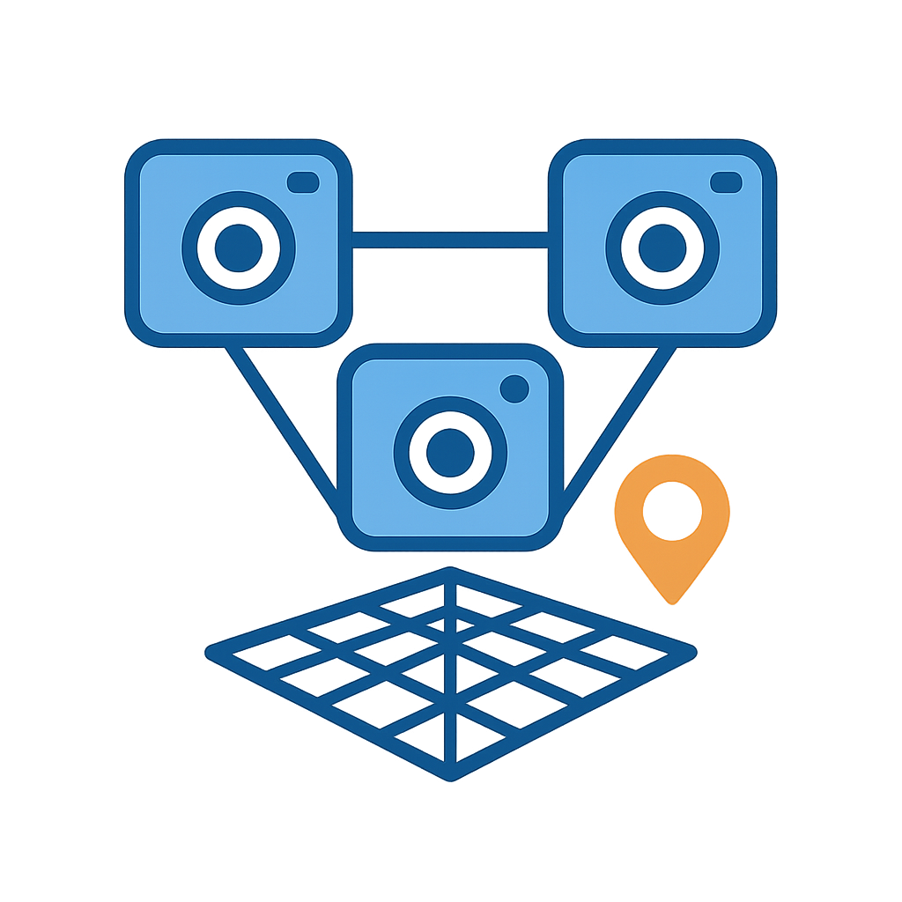

# MMSI-Bench
This repo contains evaluation code for the paper **MMSI-Bench: A Benchmark for Multi-Image Spatial Intelligence**.

[**🌐 Homepage**](https://runsenxu.com/projects/MMSI_Bench/) | [**🤗 Dataset**](https://huggingface.co/datasets/RunsenXu/MMSI-Bench) | [**📑 Paper**](https://arxiv.org/pdf/2505.23764)  | [**📖 arXiv**](https://arxiv.org/abs/2505.23764) | 


## 🔔News
  <!-- **🔥[2025-05-31]: MMSI-Bench has been supported in the [VLMEvalKit](https://github.com/open-compass/VLMEvalKit) repository.** -->

🔥[2025-05-30]: We released our paper, benchmark, and evaluation codes.


## Introduction
Spatial intelligence is essential for multimodal large language models (MLLMs) operating in the physical world. Existing benchmarks, however, probe only single-image relations and thus fail to assess the multi-image spatial reasoning that real deployments demand. We introduce **MMSI-Bench**, a VQA benchmark dedicated to multi-image spatial intelligence. Six 3D-vision researchers spent more than 300 hours crafting 1,000 challenging, unambiguous multiple-choice questions from over 120,000 images, each paired with carefully designed distractors and a step-by-step reasoning process. We conduct extensive experiments and evaluate 34 open-source and proprietary MLLMs, observing a wide gap: the strongest open-source model attains roughly 30\% accuracy and OpenAI’s o3 reasoning model reaches 40\%, while humans score 97\%. These results underscore the challenging nature of MMSI-Bench and the substantial headroom for future research. Leveraging the annotated reasoning processes, we also provide an automated error analysis pipeline that diagnoses four dominant failure modes, including (1) grounding errors, (2) overlap-matching and scene-reconstruction errors, (3) situation-transformation reasoning errors, and (4) spatial-logic errors, offering insights for advancing multi-image spatial intelligence.


MMSI-Bench systematically categorizes multi-image spatial reasoning tasks into ten basic types and one multi-step reasoning category, covering three fundamental spatial elements: camera (the agent), object (entities in the environment), and region (semantic areas like rooms). The six positional relationship categories include camera-camera, camera-object, camera-region, object-object, object-region, and region-region. In addition, there are two types of attribute reasoning (measurement and appearance), two types of motion reasoning (camera motion and object motion), and a multi-step reasoning category for more complex tasks. Each question requires information from multiple images, aiming to comprehensively evaluate a model’s ability to understand and reason about spatial relationships, attributes, and movements across images.

## Example


## Load Dataset
```
from datasets import load_dataset

vsi_bench = load_dataset("RunsenXu/MMSI-Bench")
print(dataset)
```


## Evaluation
Please refer to the [evaluation guidelines](https://github.com/open-compass/VLMEvalKit/blob/main/docs/en/Quickstart.md) of [VLMEvalKit](https://github.com/open-compass/VLMEvalKit)

```
# api model
python run.py --model Seed1.5-VL --data MMSI_Bench

# huggingface model
python run.py --model Qwen2.5-VL-7B-Instruct --data MMSI_Bench
```
<!--  -->

## 🏆 MMSI-Bench Leaderboard

| Model                        | Avg. (%) | Type         |
|------------------------------|:--------:|:-------------|
| 🥇 **Human Level**           | 97.2     | Baseline     |
| 🥈 o3                        | 41.0     | Proprietary  |
| 🥉 GPT-4.5                   | 40.3     | Proprietary  |
| Gemini-2.5-Pro--Thinking     | 37.0     | Proprietary  |
| Gemini-2.5-Pro               | 36.9     | Proprietary  |
| Doubao-1.5-pro               | 33.0     | Proprietary  |
| Qwen2.5-VL-72B               | 30.7     | Open-source  |
| NVILA-15B                    | 30.5     | Open-source  |
| GPT-4.1                      | 30.9     | Proprietary  |
| GPT-4o                       | 30.3     | Proprietary  |
| Claude-3.7-Sonnet--Thinking  | 30.2     | Proprietary  |
| Seed1.5-VL                   | 29.7     | Proprietary  |
| DeepSeek-VL2-Small           | 28.6     | Open-source  |
| InternVL2.5-8B               | 28.7     | Open-source  |
| InternVL3-78B                | 28.5     | Open-source  |
| InternVL2.5-78B              | 28.5     | Open-source  |
| LLaVA-OneVision-72B          | 28.4     | Open-source  |
| InternVL2.5-2B               | 29.0     | Open-source  |
| InternVL2.5-26B              | 28.0     | Open-source  |
| NVILA-8B                     | 28.1     | Open-source  |
| DeepSeek-VL2                 | 27.1     | Open-source  |
| InternVL3-1B                 | 27.0     | Open-source  |
| InternVL3-9B                 | 26.7     | Open-source  |
| Qwen2.5-VL-3B                | 26.5     | Open-source  |
| InternVL2.5-1B               | 26.1     | Open-source  |
| InternVL2.5-4B               | 26.3     | Open-source  |
| InternVL3-8B                 | 25.7     | Open-source  |
| Qwen2.5-VL-7B                | 25.9     | Open-source  |
| InternVL3-2B                 | 25.3     | Open-source  |
| Llama-3.2-11B-Vision         | 25.4     | Open-source  |
| 🃏 **Random Guessing**        | 25.0     | Baseline     |
| LLaVA-OneVision-7B           | 24.5     | Open-source  |
| DeepSeek-VL2-Tiny            | 24.0     | Open-source  |
| Blind GPT-4o                 | 22.7     | Baseline     |


## 🔗 Citation

If you find our work and this codebase helpful, please consider starring this repo 🌟 and cite:

```bibtex
@article{yang2025mmsi,
  title={MMSI-Bench: A Benchmark for Multi-Image Spatial Intelligence},
  author={Yang, Sihan and Xu, Runsen and Xie, Yiman and Yang, Sizhe and Li, Mo and Lin, Jingli and Zhu, Chenming and Chen, Xiaochen and Duan, Haodong and Yue, Xiangyu and Lin, Dahua and Wang, Tai and Pang, Jiangmiao},
  journal={arXiv preprint arXiv:2505.23764},
  year={2025}
}
```

## 📄 License

Shield: [![CC BY-NC 4.0][cc-by-nc-shield]][cc-by-nc]

This work is licensed under a
[Creative Commons Attribution-NonCommercial 4.0 International License][cc-by-nc].

[![CC BY-NC 4.0][cc-by-nc-image]][cc-by-nc]

[cc-by-nc]: https://creativecommons.org/licenses/by-nc/4.0/
[cc-by-nc-image]: https://licensebuttons.net/l/by-nc/4.0/88x31.png
[cc-by-nc-shield]: https://img.shields.io/badge/License-CC%20BY--NC%204.0-lightgrey.svg

## Acknowledgment
MMSI-Bench makes use of data from existing image datasets: [ScanNet](http://www.scan-net.org/), [nuScenes](https://www.nuscenes.org/), [Matterport3D](https://niessner.github.io/Matterport/), [Ego4D](https://ego4d-data.org/), [AgiBot-World](https://agibot-world.cn/), [DTU](https://roboimagedata.compute.dtu.dk/?page_id=36), [DAVIS-2017](https://davischallenge.org/) ,and [Waymo](https://waymo.com/open/). We thank these teams for their open-source contributions.

## Contact
- Sihan Yang: sihany077@gmail.com
- Runsen Xu:  runsxu@gmail.com
